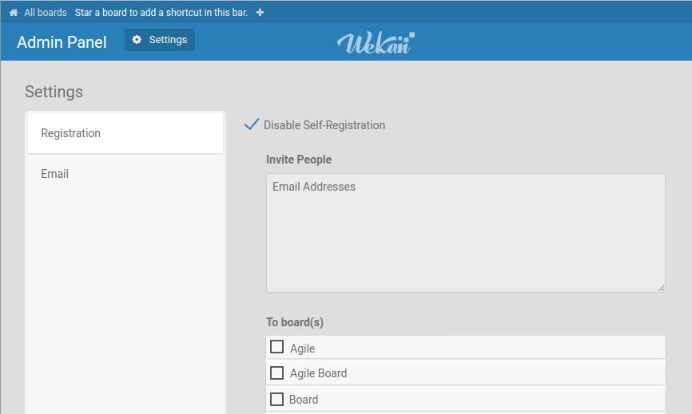
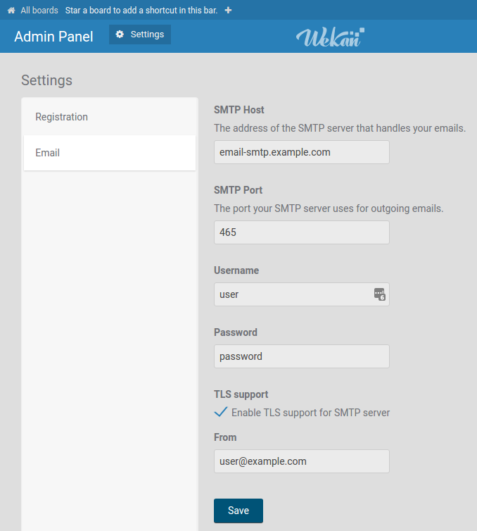

# Authentication, Admin Panel and SMTP Settings

WeKan has an **Admin Panel** for managing the whole instance, reached from your
member menu (top right corner) when you are an admin.

## Admin Panel

On the Source and Docker platforms the [Admin Panel](https://github.com/wekan/wekan/blob/main/CHANGELOG.md#v0111-rc2-2017-03-05-wekan-prerelease)
lets you:

- Allow self-registration, or switch to **invite-only** and invite users to boards.
- Manage users ("People").
- Configure **SMTP** (email) settings.
- Configure layout, accessibility, announcements, and other instance settings.

### Registration / invite-only

### SMTP email settings

## Sandstorm platform

On Sandstorm, authentication (LDAP, passwordless email, SAML, GitHub and Google
Auth) and SMTP are handled by Sandstorm. You add and remove users there, and WeKan,
Rocket.Chat and other apps can be installed with one click.

## Related

- [Login / Authentication methods](../../README.md#LoginAuth) — LDAP, OAuth2,
  SAML, Keycloak, Google, Azure, and more.
- [Members and Permissions](../Members/Members.md)
- [Accessibility settings](../Accessibility/Accessibility.md)
- [Email troubleshooting](../../Email/Troubleshooting-Mail.md)
