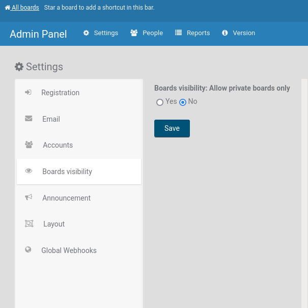

# Admin Panel / Settings / Visibility

Four groups, each with its own **Save** directly above the rule that closes it. A
Save writes only its own group's fields, so saving one cannot carry half-typed edits
from another.

## All Boards: Hide

Each row is ticked when the thing is **hidden**.

- **Public boards** — hide them: only private boards may be created, and existing
  public boards are not offered. This is the setting stored as
  `tableVisibilityMode-allowPrivateOnly`; a board you may not open says so with the
  same string. ([Wekan v5.55 and newer](../../../../CHANGELOG.md#v555-2021-08-31-wekan-release))

  

- **Board activities** — do not show the activity feed on All Boards. One global
  setting, read once by the feed, so turning it off restores each board's own value.
- **Card counter list** — hide the per-list card counts on All Boards.
- **Board member list** — hide the member avatars on All Boards.
- **Wait Spinner** — which spinner is shown while something loads. See
  [Wait Spinners](../../Troubleshooting/Wait-Spinners.md).

## URL

- **Support** — the link to `/support`, whether the page is enabled, whether it is
  public (readable without signing in), and its title and content.
- **Custom Help Link URL** — where the Help item points.
- **Custom legal notice page URL** — shown on the sign-in page.
- **Custom URL schemes** — the extra URL schemes that are turned into links
  automatically in card text, one per line. Anything not listed is left as plain
  text, which is what stops `javascript:` and friends becoming clickable.

## Product name

The name WeKan calls itself: the browser tab title, and the branding on the sign-in
page and the progress dashboards.

## Logo

- **Hide Logo** — do not show it at all.
- **Custom Login Logo Image URL** and **Link URL**, and the **text below** it.
- **Custom Top Left Corner Logo Image URL**, **Link URL** and **Height** (default
  27 px; width auto).

Sizes: the top-left corner logo is 27 px high, the login logo 300 px wide, the other
dimension automatic; a logo a little larger or smaller is scaled. jpg, png, gif and
svg all work.

An image can be hosted anywhere (`https://example.com/logo.png`). To keep it inside
WeKan: create a public board, add a card, attach the image, then copy the image link
into the field here.

## Related

- [All Boards](../../Board/Boards/Boards.md)
- [Members and Permissions](../../Members/Members.md)
