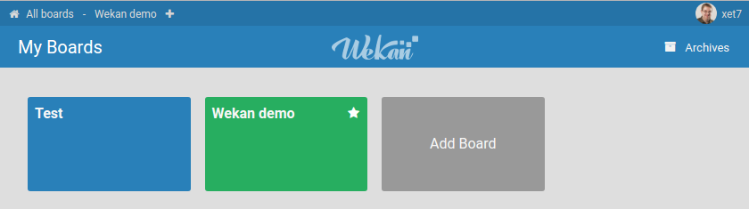
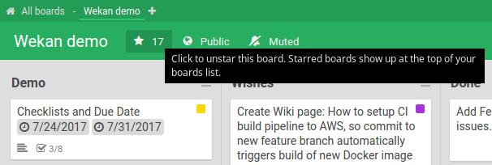
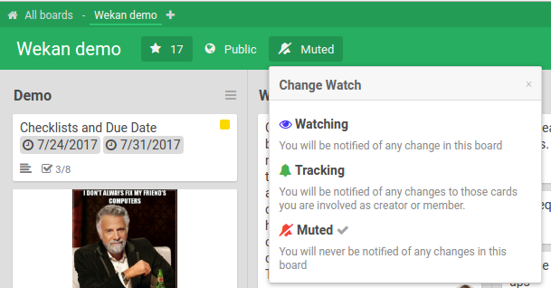
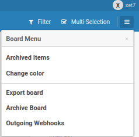
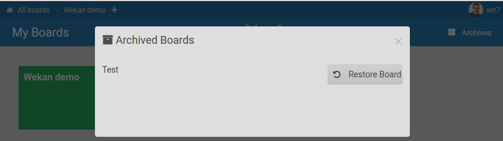

# Boards

A **board** is a Kanban board that holds your swimlanes, lists and cards. You can
have any number of public and private boards.

## List of all your boards

The **All Boards** page lists all of your public and private boards. Your starred
boards are also shown as shortcuts at the top of every page.

## Star a board

Click the star icon on a board to add it to your favorites. Starred boards appear
as quick-access shortcuts at the top of the page.

## Watch a board

Watching a board (or list/card) controls which activities create notifications for
you. You can set watch / track / mute per board.

## Board menu (hamburger)

Click the 3-lines "hamburger" menu on the right to open the board menu, where you
can change board settings, add/remove members, configure webhooks, import/export,
archive, and more.

## Restore an archived board

Archived boards are not deleted — you can restore them from the archive.

## Full screen / standalone app mode

- **Desktop:** WeKan can run as a full screen or standalone window (without browser
  buttons). See [browser standalone app mode](https://github.com/wekan/wekan/pull/1184).
- **Mobile Firefox:** see [instructions and screenshot](https://github.com/wekan/wekan/issues/953#issuecomment-336537875).

## Related

- [Board Background Images](../Board-Backgrounds/Board-Backgrounds.md)
- [Allow private boards only: Disable Public Boards](../../Admin-Panel/Allow-private-boards-only.md)
- [Swimlanes](../Swimlanes.md)
- [WIP Limits](../../Lists/WipLimit/WipLimit.md)
- [Templates](../Templates.md)
- [Archive and Delete](../Archive-and-Delete.md)
- [If board does not open and keeps loading](../../Troubleshooting/If-board-does-not-open-and-keeps-loading.md)
