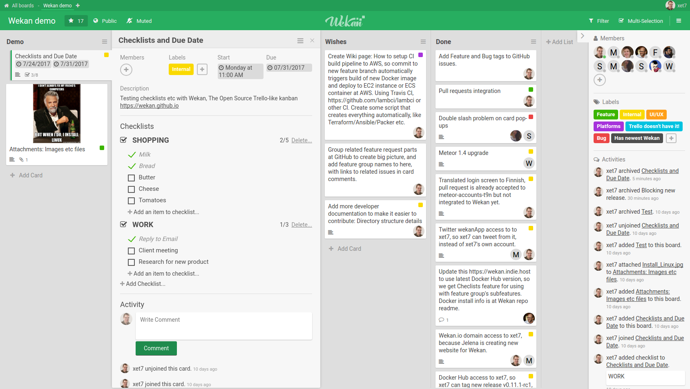
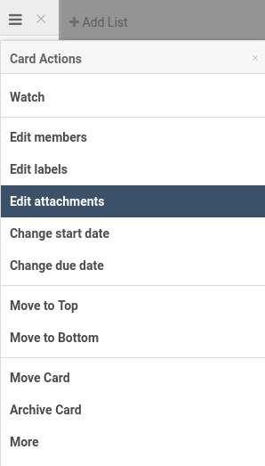
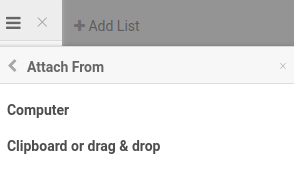
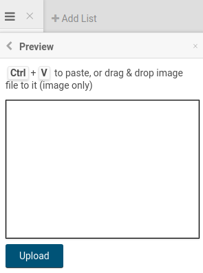
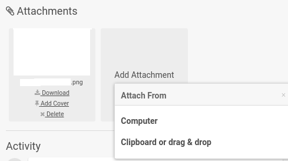
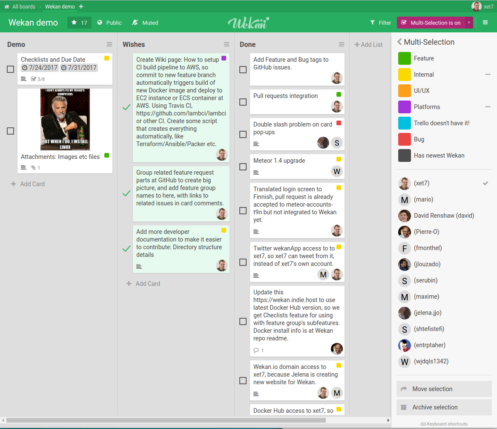
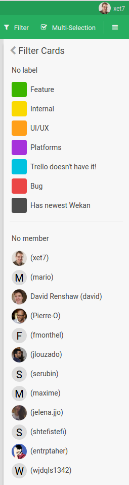

# Cards

A **card** is a single task or item. Cards live in lists and swimlanes and can hold
a lot of detail.

## What a card can contain

- Description
- Customizable, colored labels
- Checklists (with checklist templates)
- Attachments: images and files
- Comments
- Members and assignees
- Due/start/end/received dates
- Stickers ([Stickers](Stickers/Stickers.md))
- Locations ([Card Locations](Locations/Locations.md))
- A Trello-style "complete" checkbox (see below)
- Custom fields, subtasks, votes, and more



You can archive and restore a card, or delete it.

## Complete checkbox

Cards have a Trello-style **"complete"** checkbox that marks a card complete or
incomplete, independent of its due date. It is shown as an animated green checkbox to
the left of the card title, both on the minicard and in the opened card, with "Mark
as complete" / "Mark as incomplete" tooltips. The checked colour follows the board
theme (or green when no theme is set), and the minicard and opened-card checkboxes
stay in sync. Subtask checkboxes and the card-detail custom-field checkbox use the
same animated checkbox style as checklist items.

> **Tip:** Normally you archive a card so you can restore it later. To delete many
> cards faster, drag them to a new list and delete that list. Deleting cannot be
> undone — the extra clicks are by design.

The complete state can also be set over the REST API via the card edit endpoint
(`PUT /api/boards/:boardId/lists/:listId/cards/:cardId`) with `{ "dueComplete": true }`:

```bash
python3 api.py setcardcomplete BOARDID LISTID CARDID true
```

## Card aging

When **card aging** is enabled for a board (board sidebar → board settings →
"Card aging"), cards that have not been touched for a while are progressively
**faded** on the board, based on each card's last activity date (Trello-style card
aging). Hovering a faded card restores it to full opacity.

The three fade-tier **day thresholds are board-configurable** (board settings, three
number inputs shown when card aging is on), defaulting to **7 / 14 / 28** days.

Card aging and its thresholds can also be set over the REST API via the board
card-settings endpoint (`PUT /api/boards/:boardId/cardSettings`):

```bash
python3 api.py setcardsetting BOARDID cardAging true
python3 api.py setcardsetting BOARDID cardAgingDays1 5
python3 api.py setcardsetting BOARDID cardAgingDays2 10
python3 api.py setcardsetting BOARDID cardAgingDays3 20
```

## Markdown and dates

- [Markdown in card description and comments](https://github.com/wekan/wekan/issues/1038)
- [International date formatting for due date according to language](https://github.com/wekan/wekan/issues/838)

## Drag and drop / paste images

You can drag and drop images onto a card, or paste images with **Ctrl-V**.

### 1) First attachment: open the card's 3-lines "hamburger" menu / Edit Attachments



### 2) Select: Clipboard or drag and drop



### 3) Drag and drop the image, or press Ctrl-V



### 4) Add more images from the "Add Attachment" button near the first attachment



## Multi-selection

Use multi-selection to checkmark several cards, then drag and drop all of the
selected cards to another list at once.



## Filtered views

Filter the board by member, label, due date, and more to focus on a subset of cards.



## Related

- [Linked Cards](Linked-Cards.md)
- [Card Cover Image](Cover/Cover.md)
- [Stickers](Stickers/Stickers.md)
- [Card Locations](Locations/Locations.md)
- [Attachments and File Storage](Attachments/Attachments.md)
- [Custom Fields](CustomFields/CustomFields.md)
- [Subtasks](Subtasks.md)
- [Templates](../Board/Templates.md)
- [Markdown](../Editor/Markdown/Markdown.md), [Emoji](../Editor/Emoji.md), [Multiline](../Editor/Multiline.md), [Numbered text](../Editor/Numbered-text.md), [LaTeX](../Editor/LaTeX.md)
- [Due Date](../../Date/Due-Date.md), [Time Tracking](../../Date/Time-Tracking.md)
- [Drag and Drop on Mobile and Desktop](../../DragDrop/Drag-Drop.md)
