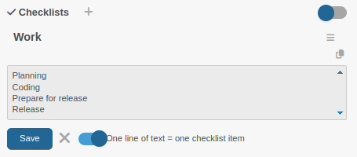
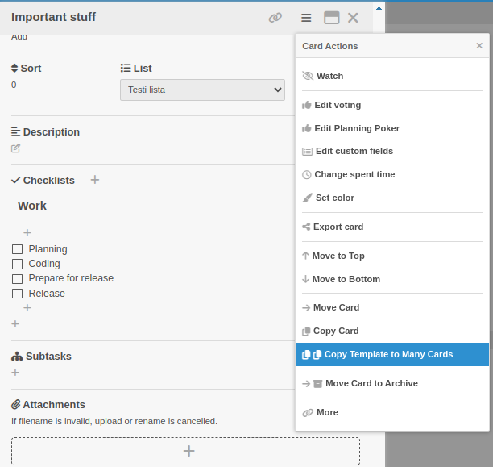
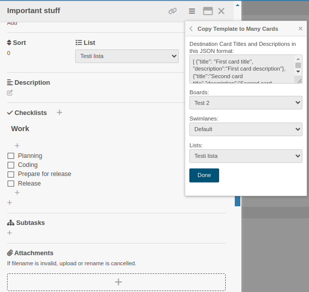

## Multiple lines to Checklist

1. Click Add new Checklist
2. Click Add new Checklist Item
3. Toggle `One line of text = one checklist item`
4. Paste multiple lines of text
5. Click Save



## Card ☰ Menu / Copy Checklist Template to Many Cards



## Edit titles and descriptions of Many Cards
```
[ {"title": "First card title", "description":"First card description"},
{"title":"Second card title","description":"Second card description"},
{"title":"Last card title","description":"Last card description"} ]
```


