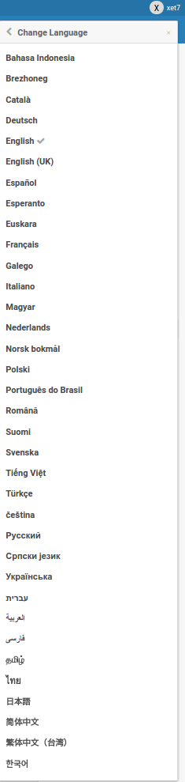

# WeKan Features

This page is an index of WeKan features. It used to be one long page; it has been
split into focused topic pages under [`docs/Features/`](.).

Not every feature from the [CHANGELOG](https://github.com/wekan/wekan/blob/main/CHANGELOG.md)
is documented yet — contributions are welcome.

## Kanban basics

- [Boards](Boards/Boards.md) — board list, star/watch, board menu, restore archived
  boards, full-screen / standalone app mode.
- [Lists](Lists/Lists.md) — add, archive, restore and delete lists.
- [Cards](Cards/Cards.md) — description, labels, checklists, attachments, comments,
  markdown, dates, drag-and-drop images, multi-selection, filtered views.
- [Swimlanes](Swimlanes.md)
- [WIP Limits](WipLimit/WipLimit.md)
- [Members and Permissions](Members/Members.md)
- [Templates](Templates.md)
- [Shared Templates (Admin view)](SharedTemplates/SharedTemplates.md)
- [Archive and Delete](Archive-and-Delete.md)
- [Keyboard Shortcuts](Keyboard-Shortcuts/Keyboard-Shortcuts.md)
- [Accessibility](Accessibility/Accessibility.md)
- [Rules (Automation)](Rules/Rules.md)
- [Card Dependencies — "Red Strings" / PI Program Board](RedStrings/RedStrings.md)

## Card content and formatting

- [Card Cover Image](Cover/Cover.md)
- [Stickers](Stickers/Stickers.md)
- [Card Locations](Locations/Locations.md)
- [Attachments and File Storage](Attachments/Attachments.md)
- [Board Background Images](Board-Backgrounds/Board-Backgrounds.md)
- [Custom Fields](CustomFields/CustomFields.md)
- [Subtasks](Subtasks.md)
- [Linked Cards](Linked-Cards.md)
- [Markdown](Markdown/Markdown.md), [Emoji](Emoji.md), [Multiline](Multiline.md),
  [Numbered text](Numbered-text.md), [LaTeX](LaTeX.md)
- [Drag and Drop on Mobile and Desktop](../DragDrop/Drag-Drop.md)
- [Right-to-Left (RTL) UI](RTL/RTL.md)

## Planning and time

- [Due Date](../Date/Due-Date.md)
- [Time Tracking](../Date/Time-Tracking.md)
- [Calendar](../Date/Calendar.md)
- [Gantt Chart](Gantt.md)
- [Planning Poker](Planning-Poker.md)
- [Burndown and Velocity Chart](Burndown-and-Velocity-Chart.md)

## Administration

- [Authentication, Admin Panel and SMTP Settings](Admin-Panel/Admin-Panel.md)
- [Allow private boards only: Disable Public Boards](Allow-private-boards-only.md)
- [Login / Authentication methods](../README.md#LoginAuth) — LDAP, OAuth2, SAML,
  Keycloak, Google, Azure, and more.
- [Metrics](Metrics.md), [Logs](Logs.md), [Stats](Stats/Stats.md)
- [Cleanup](Cleanup/Cleanup.md)
- [Python based features](Python.md)

## Import and Export

- [Import / Export / Sync](../ImportExport/Sync.md)
- [From Trello](../ImportExport/trello/Migrating-from-Trello.md),
  [Jira](../ImportExport/Jira.md), [Asana](../ImportExport/asana/Asana.md),
  [Zenkit](../ImportExport/ZenKit.md), [CSV/TSV](../ImportExport/CSV/CSV.md)
- [Export board](https://github.com/wekan/wekan/pull/1059). If the Export menu is
  not visible, [set yourself as board admin](https://github.com/wekan/wekan/issues/1060).
- Working with big boards: [JSON tools, copying files to clipboard](https://github.com/wekan/wekan/issues/610#issuecomment-310862951)

## Integrations

- [REST API](../API/REST-API.md) and [API docs](https://wekan.fi/docs/)
- [Webhooks](../Webhooks/Receiving-Webhooks.md) — per-board events; configure at the
  board right sidebar / Board Settings / Webhooks. See also
  [Outgoing Webhook to Discord/Slack/Rocket.Chat](../Webhooks/Discord/Outgoing-Webhook-to-Discord.md).
- [IFTTT](IFTTT/IFTTT.md)
- [Integrations](../ImportExport/Integrations.md)

## Translations

- [Translate WeKan at Transifex](https://app.transifex.com/wekan/)
- [Translations](../Translations/Translations.md),
  [Customize Translations](../Translations/Customize-Translations.md),
  [Change Language](../Translations/Change-Language.md)

## Versions of Meteor and Node

WeKan tracks current Meteor and Node.js releases. As of WeKan 8.75 and newer it uses
**Meteor 3.5-beta.x** and **Node.js 24.x**, with **MongoDB 7.x (or 6.x)** or
[FerretDB2/PostgreSQL](../Databases/FerretDB2-PostgreSQL.md). WeKan 8.43 upgraded to
Meteor 3.x. For the exact versions of each release, see the
[CHANGELOG](https://github.com/wekan/wekan/blob/main/CHANGELOG.md).

## Roadmap and feature requests

Many features that were once on the wishlist — Custom Fields, Subtasks, Swimlanes,
Gantt charts, WIP limits, voting on cards, board templates and checklist templates —
are now implemented (see the topic pages above).

- [WeKan Roadmap kanban board](https://boards.wekan.team/b/D2SzJKZDS4Z48yeQH/wekan-open-source-kanban-board-with-mit-license)
- [Multiverse WeKan Roadmap](../Design/Multiverse/WeKan-Multiverse-Roadmap.md)
- [Feature requests](https://github.com/wekan/wekan/issues?utf8=%E2%9C%93&q=is%3Aissue%20is%3Aopen%20feature)

## More

- [Platforms](../Platforms/FOSS/Platforms.md)
- [Integrations](../ImportExport/Integrations.md)
