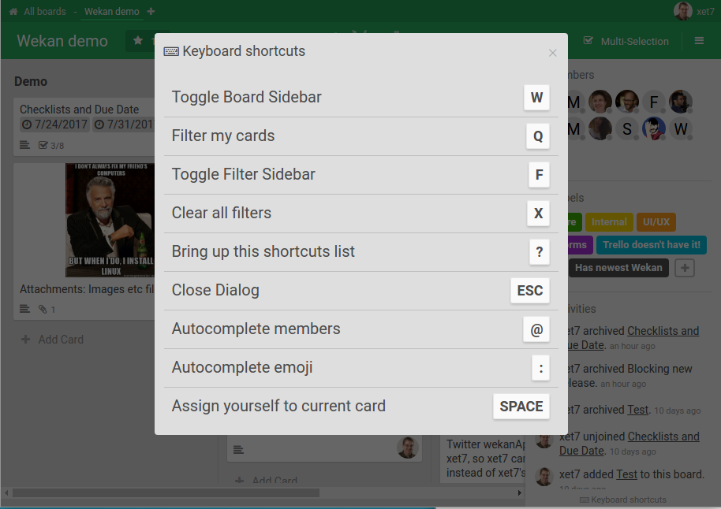

# Keyboard Shortcuts

WeKan has many keyboard shortcuts for fast, mouse-free use.

- Press **`?`** anywhere in WeKan to open the list of keyboard shortcuts.
- There is also a keyboard-shortcuts button at the bottom right corner.
- Keyboard shortcuts can be toggled on or off from the board sidebar.

## Related

- [Accessibility](../Accessibility/Accessibility.md) — keyboard navigation, focus,
  and screen-reader support.
