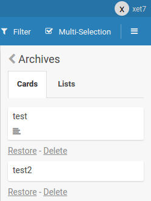

# Lists

**Lists** are the columns of a board. Cards move between lists as work progresses.

## Add, archive, restore and delete lists

- **Add** a list with the list composer at the side of the board.
- **Archive** a list to hide it without deleting it; archived lists can be restored.
- **Delete** a list permanently (deleting cannot be undone — this requires extra
  clicks by design, see the tip below).

> **Tip:** Normally you archive a card so you can restore it later. If you want to
> delete many cards faster, drag them to a new list and delete that list. Deleting
> cannot be undone — the extra clicks are by design. Previously there was an
> easily-clicked delete button and people deleted important lists by accident; that
> was fixed.

## List width

Each list has a single width. You can change it in two ways:

- **Drag** the resize handle on the right edge of a list, or
- open the list menu → **Set width** and type a width in pixels (minimum 270).

### Shared vs personal widths (#6409)

A board setting controls who a width change affects. Open the board's
**"Show at all boards page"** settings (board sidebar) and toggle
**Personal list widths**:

- **Off (default) — Shared:** the width is stored on the list itself
  (`lists.width`) and is the same layout for **everyone** on the board. Only
  members with **write access** can change it (read-only / comment-only members
  do not see the resize handle). The width travels with the board when you
  **export/import** it.
- **On — Personal:** each user keeps **their own** widths (saved in their user
  profile, or in the browser's localStorage when not logged in). A user's
  personal width falls back to the shared width, then to the default (272 px),
  when they have not set their own.

### Auto-width

Instead of a fixed width, you can make lists **fit their content** (auto-width):
open the list menu → **Set width** → the **Auto list width** toggle. Auto-width
applies to all lists on the board and follows the same scope as fixed widths:

- in **Shared** mode it is a per-board setting (changed by members with write
  access, the same for everyone), and
- in **Personal** mode it is per-user.

While auto-width is on, the fixed-width input and the drag handle are hidden.

The previous per-list "min width / max width" pixel options were removed: a list
now has one clear width (fixed or auto) that reliably persists across reloads.

## Related

- [WIP Limits](WipLimit/WipLimit.md)
- [Swimlanes](../Board/Swimlanes.md)
- [Archive and Delete](../Board/Archive-and-Delete.md)
