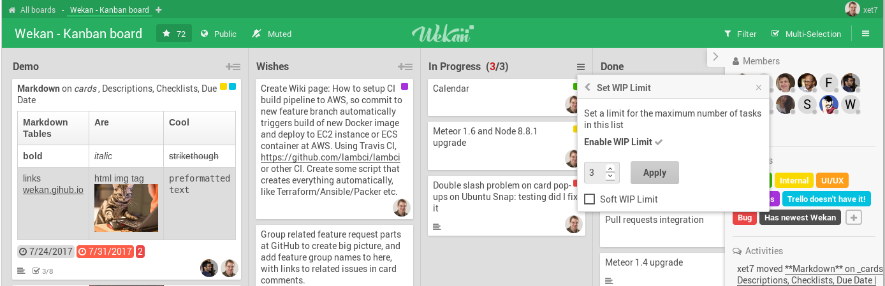
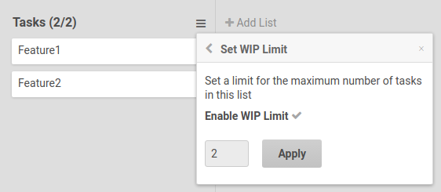

# WIP Limits

A **Work In Progress (WIP) limit** caps how many cards a list may contain. When a
list reaches its limit, you cannot add more cards until some are moved out, which
helps the team focus and avoid overload.

## Enabling a WIP limit

Open a list's header menu and set its WIP limit. When the limit is reached, the
list indicates it and blocks adding further cards.

## Related

- [Lists](../Lists.md)
- [Burndown and Velocity Chart](../../Reports/Burndown-and-Velocity-Chart.md)
