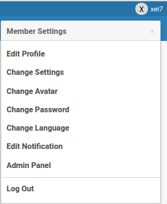
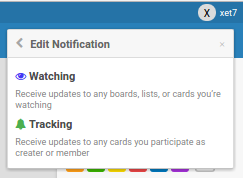
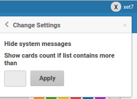
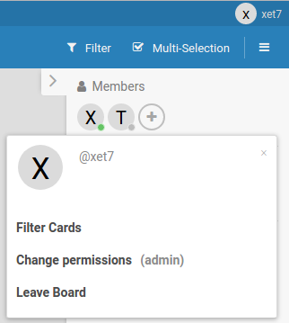
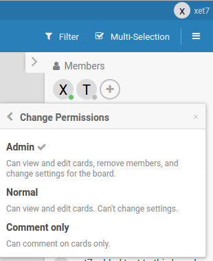

# Members and Permissions

Boards can have many members, so you can collaborate with your team. You add
members to a board, and optionally assign them to individual cards.

## Member settings menu

Click your username/avatar in the top right corner to open your member settings.

> NOTE: The duplicate "Edit Notification" entry was removed from this menu in
> [PR #1948](https://github.com/wekan/wekan/pull/1948), so Edit Notification is only
> available from the menu shown below.

### Edit Notification

### Change settings (for example hide system messages)

## Board members

Click a member's initials or avatar to filter the board by that member, or to open
the member's permission settings.

## Permissions: Admin / Normal / Comment only

Click a member's initials or avatar to set their role on the board:

- **Admin** — full control of the board.
- **Normal** — can edit cards.
- **Comment only** — can only add comments, not edit cards.

## Share a board with an email Domain

In the board members sidebar there is a **Domains** tab. From it you can share a
board with a whole email **domain** (for example `example.com`), so every user with
a verified email address on that domain becomes a member of the board. This is in
addition to sharing with individual members, Organizations and Teams.

## Notify on assign

When a user is added as a card **member** or **assignee**, they can be notified
directly. This is controlled by the environment variable:

- `NOTIFY_ON_ASSIGN` (default `true`) — when `true`, the user added as a card
  member/assignee gets a direct notification. Set to `false` to disable these
  notifications instance-wide. On Snap use `notify-on-assign`.

## Restrict board members to the same Organization or Team

On multi-tenant instances you can require that a board's members share an Organization
or Team. When the global admin setting `boardMembersFromSameOrgOrTeamOnly` is enabled, a
user can only be added to a board if they share at least one Organization or Team with the
inviter or with an active board member (site admins bypass this). See
[Admin Panel](../Admin-Panel/Admin-Panel.md).

## Related

- [Adding Users](../../Login/Adding-users.md)
- [Admin: Impersonate user](../../Login/Impersonate-user.md)
- [Admin Panel](../Admin-Panel/Admin-Panel.md)
