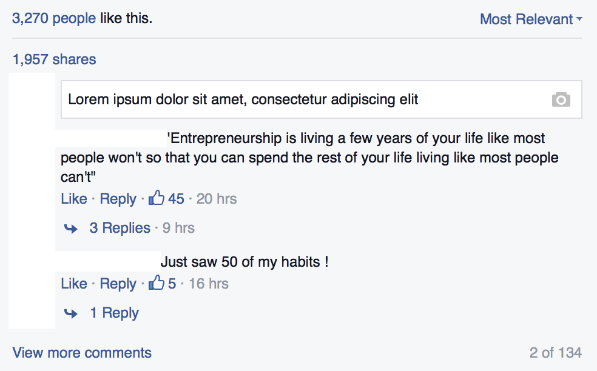
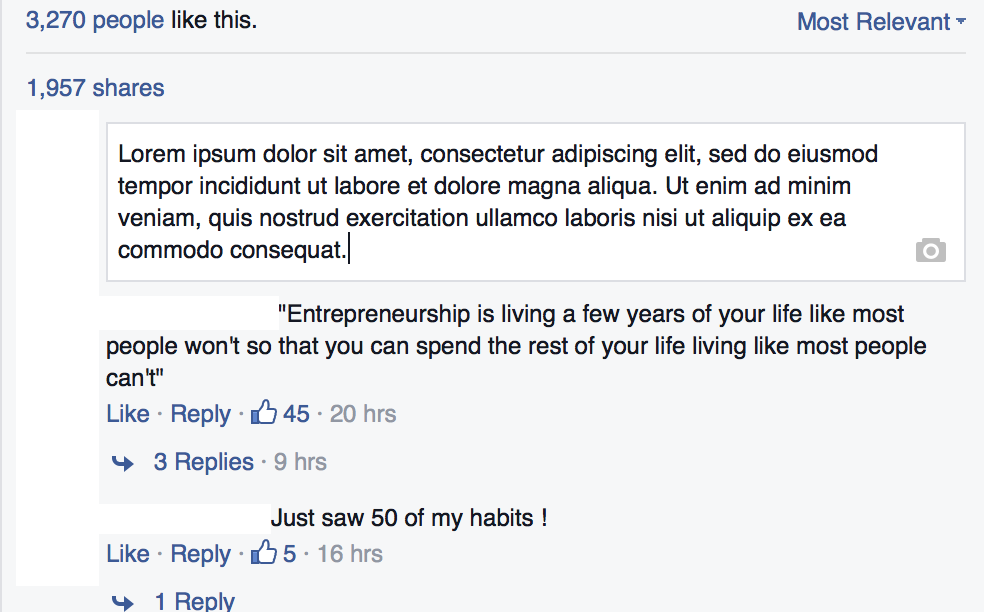

meteor-autosize
======================

Ever wondered how to make autoresizable Facebook-style textarea inputs? Autosize is a small, stand-alone script to automatically adjust (resize) textarea height to fit text.
Repackaged for Meteor.




## Installation

`meteor add verron:autosize`

## Example

````javascript
// from a NodeList
autosize(document.querySelectorAll('textarea'));

// from a single Node
autosize(document.querySelector('textarea'));

// from a jQuery collection
autosize($('textarea'));
````

#### Browser compatibility

Chrome | Firefox | IE | Safari | iOS Safari | Android | Opera Mini | Windows Phone IE
------ | --------|----|--------|------------|---------|------------|------------------
yes    | yes     | 9  | yes    | yes        | 4       | ?          | 8.1


#### Documentation and Demo

http://www.jacklmoore.com/autosize/

#### Original package

https://github.com/jackmoore/autosize/

#### Author

The Meteor repackage was created by Spendflow, updated by Kelly Copley (@copleykj) for the new 0.9.0 packaging system and updated to v3 (pure javascript version) by Ronen Verdi ([@v3rron](https://github.com/v3rron)).
