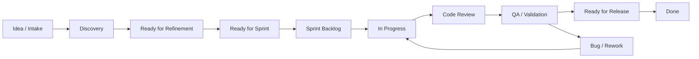

# Bài 2 - Scrum, Kanban và Lean Delivery Workflow

Trạng thái bài làm: đã hoàn thành bản thiết kế workflow delivery cho team phần
mềm mini, gồm board columns, policy, WIP limit, Definition of Ready,
Definition of Done, luật xử lý ngoại lệ, backlog mẫu và metrics.

## 1. Bài này nói về gì?

Bài tập này thiết kế cách một công ty phần mềm dùng Scrum, Kanban và Lean để
đưa việc từ ý tưởng đến sản phẩm chạy được.

Nói đơn giản:

- Scrum trả lời: team học và giao hàng theo sprint như thế nào?
- Kanban trả lời: việc đang chảy qua board ra sao, đang tắc ở đâu?
- Lean trả lời: phần nào là lãng phí và cần loại bỏ?

Kết quả cuối cùng của bài là một delivery workflow có thể dùng ngay cho công
ty phần mềm mini đã mô tả ở Bài 1.

## 2. Bối cảnh

Team đang xây SaaS quản lý công việc cho doanh nghiệp nhỏ và vừa. Sau Bài 1,
team đã phát hiện 5 vấn đề lớn:

1. Product Goal chưa rõ.
2. Backlog item thiếu acceptance criteria.
3. Sprint Review chưa có feedback thật.
4. Scope thay đổi giữa sprint chưa được kiểm soát.
5. Definition of Done và test automation chưa đủ chặt.

Bài 2 sẽ cải thiện bằng cách thiết kế lại board và quy tắc vận hành.

## 3. Mục tiêu bài tập

Thiết kế một workflow delivery đáp ứng các yêu cầu sau:

- Có đủ các bước từ discovery đến Done.
- Có WIP limit để tránh team làm quá nhiều việc cùng lúc.
- Có policy rõ ràng cho từng cột.
- Có cách xử lý bug, blocker và scope change.
- Có liên kết với Scrum events.
- Có metric để biết workflow có tốt hơn không.

## 4. Mô hình kết hợp

| Thành phần | Dùng để làm gì trong team này? |
| --- | --- |
| Scrum | Tạo nhịp sprint, Sprint Goal, Planning, Daily, Review, Retrospective. |
| Kanban | Hiển thị dòng chảy công việc, giới hạn WIP, phát hiện tắc nghẽn. |
| Lean | Loại bỏ lãng phí: chờ đợi, bàn giao thừa, làm lại, scope không cần thiết. |

Nguyên tắc vận hành:

```text
Scrum tạo nhịp học.
Kanban làm dòng chảy công việc nhìn thấy được.
Lean giúp team bỏ bớt việc không tạo giá trị.
```

## 5. Workflow đề xuất



## 6. Board columns và policy

| Cột | Mục đích | Entry policy | Exit policy | WIP |
| --- | --- | --- | --- | ---: |
| Idea / Intake | Ghi nhận ý tưởng, request, bug, feedback. | Có nguồn và lý do. | PO quyết định có cần discovery không. | Không giới hạn |
| Discovery | Làm rõ problem, user, value và risk. | Có owner discovery. | Có evidence đủ để viết backlog item. | 3 |
| Ready for Refinement | Chuẩn bị để team làm rõ. | Có mô tả user/problem. | Có acceptance criteria và estimate sơ bộ. | 8 |
| Ready for Sprint | Item đủ sẵn sàng để chọn vào sprint. | Đã refine, nhỏ, có value. | Được PO chọn vào Sprint Planning. | 10 |
| Sprint Backlog | Việc team cam kết trong sprint. | Gắn với Sprint Goal. | Developer kéo khi sẵn sàng làm. | Theo capacity |
| In Progress | Đang được build. | Developer đã nhận việc. | Code xong, test local xong, tạo pull request. | 3 |
| Code Review | Đang review code. | Pull request sẵn sàng review. | Review pass hoặc cần rework. | 2 |
| QA / Validation | Kiểm tra acceptance criteria và risk. | Code review pass. | QA/PO xác nhận đạt yêu cầu. | 3 |
| Ready for Release | Sẵn sàng deploy/release. | Pass DoD, có release note nếu cần. | Deploy xong hoặc chốt release. | 5 |
| Done | Hoàn thành theo Definition of Done. | Đã release hoặc deployable theo policy. | Không quay lại trừ khi phát hiện bug mới. | Không giới hạn |

## 7. Definition of Ready

Một backlog item được coi là Ready for Sprint khi có đủ:

- User hoặc customer segment rõ.
- Lý do business/user value rõ.
- Acceptance criteria.
- Dependencies/risk nếu có.
- Estimate đủ để team biết item có vừa sprint không.
- Không còn câu hỏi lớn cản trở implementation.

## 8. Definition of Done

Một item được coi là Done khi:

- Acceptance criteria met.
- Code reviewed.
- Unit/integration tests pass nếu liên quan.
- UI checked nếu có thay đổi UI.
- QA/PO validation pass.
- Security/privacy checked nếu item có dữ liệu nhạy cảm.
- Release note/docs updated nếu user-facing.
- Deployable hoặc đã deployed theo policy.

## 9. Scrum events gắn với workflow

| Event | Workflow dùng như thế nào? |
| --- | --- |
| Backlog Refinement | Kéo item từ Ready for Refinement sang Ready for Sprint. |
| Sprint Planning | Chọn item từ Ready for Sprint vào Sprint Backlog và viết Sprint Goal. |
| Daily Scrum | Nhìn flow từ In Progress đến QA để phát hiện blocker và WIP quá tải. |
| Sprint Review | Demo các item Done, lấy feedback để tạo Idea/Intake mới. |
| Retrospective | Xem metric, bottleneck và chọn 1-2 improvement actions. |

## 10. Luật xử lý bug, blocker và scope change

### Bug

- Bug mới vào Idea / Intake với severity.
- Bug critical có thể đi thẳng vào Sprint Backlog nếu PO và Developers đồng ý.
- Bug không critical được PO order lại trong Product Backlog.

### Blocker

- Card bị blocker phải ghi rõ blocker là gì, ai cần xử lý và thời hạn follow-up.
- Blocker được nhắc trong Daily Scrum.
- Nếu blocker kéo dài quá 24 giờ, Scrum Master escalation.

### Scope change

- Không chèn việc trực tiếp vào Developers.
- PO phải nói rõ lý do thay đổi.
- Developers đánh giá impact.
- Nếu vẫn cần làm trong sprint, team swap item hoặc renegotiate Sprint Goal.

## 11. Lean waste cần loại bỏ

| Waste | Dấu hiệu trong team | Cách giảm |
| --- | --- | --- |
| Waiting | QA chờ đến cuối sprint mới có việc test. | Test sớm từng item nhỏ, QA tham gia refinement. |
| Handoff | BA viết xong rồi ném sang dev, dev xong ném sang QA. | PO/BA/Dev/QA refine cùng nhau. |
| Rework | Item thiếu acceptance criteria nên làm lại nhiều. | Definition of Ready trước khi vào sprint. |
| Overproduction | Build feature chưa có evidence từ user. | Discovery và Sprint Review có feedback thật. |
| Context switching | Developer làm quá nhiều item cùng lúc. | WIP limit cho In Progress và Code Review. |

## 12. Sample backlog cho Sprint 1

Sprint Goal:

```text
Giúp owner của doanh nghiệp nhỏ tạo board đầu tiên và mời team vào làm việc
trong dưới 10 phút.
```

| Item | User story | Acceptance criteria | Size |
| --- | --- | --- | ---: |
| 1 | As a new owner, I want to create my first board so that I can organize team work. | Can create board from empty state; board appears after create; error state shown. | 3 |
| 2 | As a new owner, I want to invite teammates by email so that my team can join the board. | Can enter emails; invalid emails show error; invite status is visible. | 5 |
| 3 | As a teammate, I want a clear invitation email so that I know where to join. | Email contains board name, inviter, CTA and expiry note. | 2 |
| 4 | As a new user, I want starter lists so that I do not start from a blank board. | New board has Todo, Doing, Done; user can rename lists. | 3 |
| 5 | As a support person, I want to see failed invites so that I can help customers. | Failed invite is logged with reason; support can inspect status. | 3 |

## 13. Metrics cần theo dõi

| Metric | Vì sao cần đo? | Target ban đầu |
| --- | --- | --- |
| Cycle time | Biết từ lúc bắt đầu làm đến Done mất bao lâu. | Giảm 20% sau 3 sprint. |
| Throughput | Biết mỗi sprint hoàn thành bao nhiêu item Done thật. | 5-8 item nhỏ/sprint. |
| WIP aging | Biết card nào nằm quá lâu ở một cột. | Không card nào kẹt quá 3 ngày. |
| Escaped defects | Biết bug lọt ra sau release. | Giảm dần qua mỗi sprint. |
| Review feedback count | Biết Sprint Review có tạo học hỏi thật không. | Ít nhất 5 feedback notes/sprint. |

## 14. Bài làm tóm tắt

Team sẽ dùng Scrum làm nhịp delivery, Kanban để nhìn dòng chảy công việc và
Lean để loại bỏ lãng phí. Board mới có 10 cột từ Idea / Intake đến Done, có
WIP limit ở các cột dễ tắc như In Progress, Code Review và QA / Validation.

Điểm cải thiện lớn nhất là team không đưa việc mơ hồ vào sprint nữa. Item phải
qua Definition of Ready trước khi vào Sprint Backlog và phải qua Definition of
Done trước khi được tính là hoàn thành.

## 15. Checklist hoàn thành

- [x] Board có đủ các cột workflow.
- [x] Mỗi cột có entry policy và exit policy.
- [x] WIP limit đã được thống nhất.
- [x] Definition of Ready đã được dùng trong refinement.
- [x] Definition of Done đã được dùng trước khi chuyển Done.
- [x] Bug, blocker và scope change có rule xử lý.
- [x] Sprint Goal đã được viết.
- [x] Ít nhất 5 backlog items được refine theo format mới.
- [x] Metrics được chọn cho sprint tiếp theo.

## 16. File liên quan trong WeKan

Nếu triển khai trong WeKan, bài này nên có một khu vực riêng:

- `10 Exercise 2 - Scrum Kanban Lean Workflow`.

Các cột workflow thực tế nên được dùng cho board sản phẩm riêng, không trộn lẫn
với board học lý thuyết.
